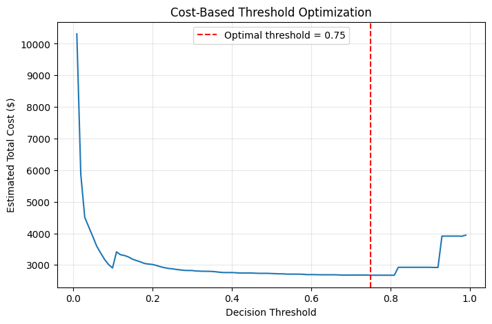
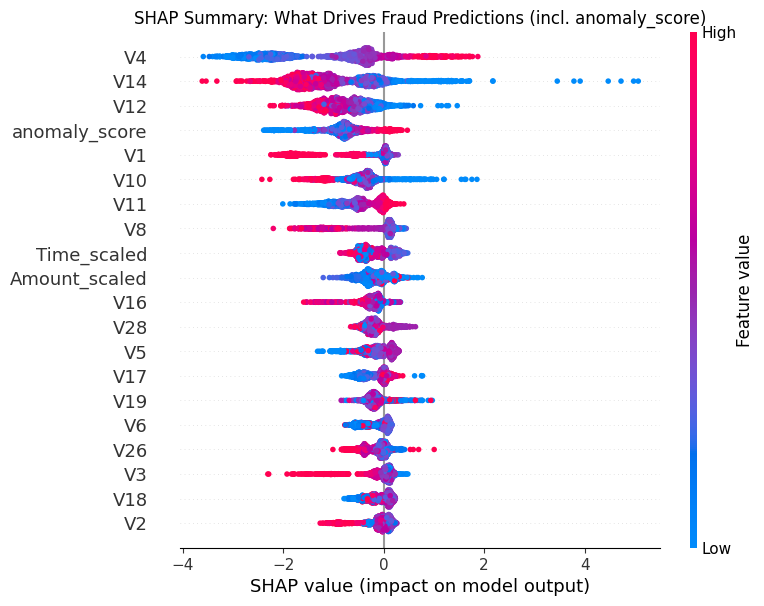
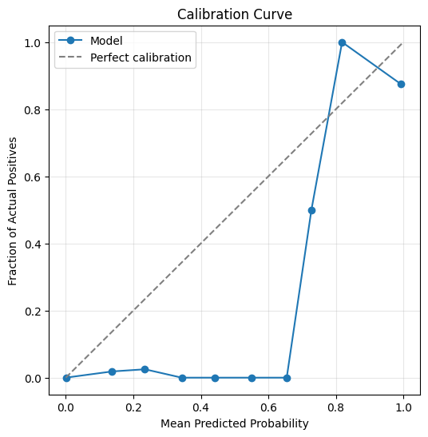

# Credit Card Fraud Detection — Cost-Aware Hybrid Model

A fraud detection pipeline built on the [ULB Credit Card Fraud dataset](https://www.kaggle.com/datasets/mlg-ulb/creditcardfraud), focused on doing imbalanced classification *properly* rather than chasing a misleading accuracy number.

## The problem with this dataset

284,807 transactions, only 492 fraudulent (0.173%). A model that predicts "not fraud" for every single transaction scores **99.83% accuracy** while catching zero fraud. Accuracy is meaningless here — this project is built around metrics and decisions that actually reflect the imbalance.

## What this project does differently

Most public notebooks on this dataset stop at one of the items below. This one does all of them together:

1. **Time-based validation** — trains on the first 80% of transactions chronologically, tests on the last 20%, instead of a random split. A random split lets similar transactions leak across train/test; a time-based split simulates deploying a model trained on the past to catch future fraud.
2. **Hybrid supervised + unsupervised features** — an Isolation Forest anomaly score (trained without labels) is engineered as an input feature to the supervised XGBoost model, giving it a "how structurally unusual is this transaction" signal on top of the raw PCA components.
3. **Cost-based threshold optimization** — instead of tuning the decision threshold for F1, the threshold is chosen to minimize estimated real dollar loss (missed fraud costs the transaction amount; false positives cost a fixed investigation fee).
4. **Calibration check** — verifies whether the model's predicted probabilities are trustworthy (a "0.9 probability" prediction should mean ~90% actual fraud rate), not just good at ranking.
5. **SHAP explainability** — both global feature importance and a single-transaction explanation, so predictions aren't a black box.

## Results

| Metric | Value |
|---|---|
| PR-AUC (time-based split) | **0.80** |
| ROC-AUC | 0.99 |
| Precision @ cost-optimal threshold | 0.88 |
| Recall @ cost-optimal threshold | 0.77 |
| Estimated cost savings vs. default 0.5 threshold | $54 on the test set |

**Baseline comparison:** a plain Logistic Regression with no imbalance handling caught only 64% of fraud (recall). The tuned XGBoost model with `scale_pos_weight` and a cost-optimized threshold catches 77% of fraud at 88% precision.

**On the time-based split:** PR-AUC dropped from 0.86 (random split) to 0.80 (time-based split) when validation was corrected. This is expected and reported deliberately — the random-split number was mildly optimistic due to leakage across near-identical transactions. The 0.80 figure is the honest one.

## Findings worth calling out

- **The Isolation Forest anomaly feature is a real but secondary signal.** It did not rank in the top 5 features by XGBoost's gain metric (which measures usefulness for tree splits), but it ranked #4 by mean SHAP value (which measures actual impact on individual predictions). These two metrics answering differently is itself informative — the raw PCA features (V4, V14, V12) drive most split decisions, but the anomaly score still meaningfully shifts individual predictions in the expected direction (higher anomaly score → higher fraud probability).
- **Calibration is solid at low predicted probability, noisy at high predicted probability.** With only 75 fraud cases in the test set, the highest-confidence bins contain very few examples, so the calibration curve is more volatile there. This is a sample-size limitation, not a modeling flaw — reported explicitly rather than smoothed over.
- **Cost-aware tuning produced a modest, not dramatic, improvement ($54 saved on this test set).** The value of this step is the methodology — optimizing against an actual financial cost function instead of an abstract classification metric — not the specific dollar figure, which is scaled to the small size of this dataset's test split.

## Pipeline

```
Raw transactions
      │
      ├─ Time-based train/test split (sorted by Time)
      │
      ├─ StandardScaler on Amount & Time (fit on train only)
      │
      ├─ Isolation Forest (unsupervised) → anomaly_score feature
      │
      ├─ XGBoost classifier (scale_pos_weight for imbalance)
      │       │
      │       ├─ PR-AUC / ROC-AUC evaluation
      │       ├─ Cost-based threshold search (minimize $ loss)
      │       ├─ Calibration curve
      │       └─ SHAP explainability
      │
      └─ Saved model: fraud_detection_hybrid_model.json
```

## Setup

```bash
pip install pandas numpy matplotlib seaborn scikit-learn xgboost shap
```

Run in a Kaggle Notebook with the [creditcardfraud dataset](https://www.kaggle.com/datasets/mlg-ulb/creditcardfraud) added as a data source, or locally with `creditcard.csv` in the working directory (update the `find_file` path logic accordingly).

```bash
python fraud_detection_hybrid_pipeline.py
```

## Outputs

- `outputs/cost_threshold_curve.png` — total estimated cost vs. decision threshold
- `outputs/confusion_matrix.png` — at the cost-optimal threshold
- `outputs/calibration_curve.png` — predicted probability vs. actual fraud rate
- `outputs/shap_summary.png` — global feature importance
- `outputs/shap_example_explanation.png` — one individual fraud prediction explained
- `fraud_detection_hybrid_model.json` — trained XGBoost model

### Key visuals





## Dataset

Mohanty, S.P., Hughes, D.P., Salathé, M. — [ULB Machine Learning Group / Worldline](http://mlg.ulb.ac.be), via [Kaggle](https://www.kaggle.com/datasets/mlg-ulb/creditcardfraud). Features V1–V28 are PCA-transformed for confidentiality; `Time` and `Amount` are the only untransformed features.

## Limitations

- All features except `Time` and `Amount` are anonymized PCA components — no domain-level feature engineering was possible.
- The dataset covers only two days of transactions; a production model would need continuous retraining and drift monitoring, which is out of scope here.
- The cost model (fixed $5 investigation cost per false positive) is a simplifying assumption, not a real institution's actual cost structure.
- With only 492 total fraud cases, results — especially calibration at high-confidence thresholds — carry meaningful statistical uncertainty.

## License & Dataset Terms

- **Code & Pipeline:** Licensed under the [MIT License](LICENSE).
- **Dataset:** The [ULB Credit Card Fraud dataset](https://www.kaggle.com/datasets/mlg-ulb/creditcardfraud) is made available under the Open Database License (ODbL) by the Machine Learning Group (MLG) at ULB and Worldline.
